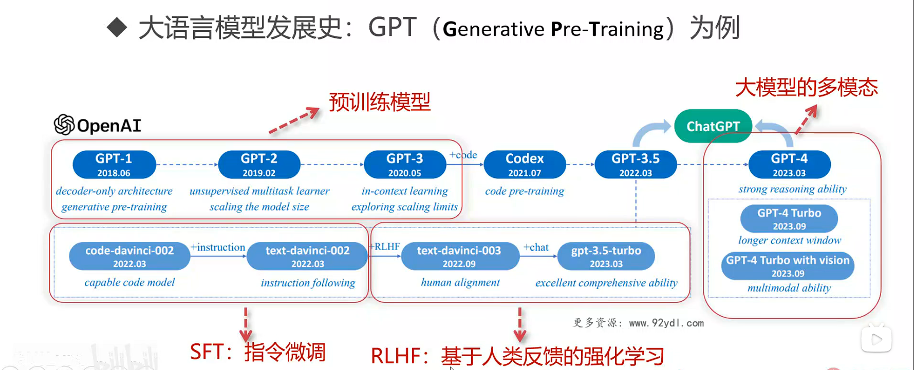
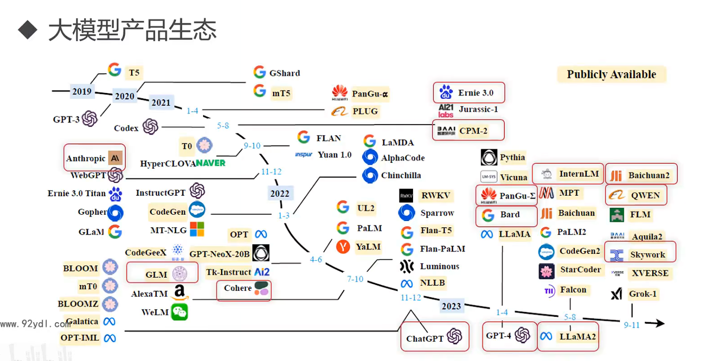
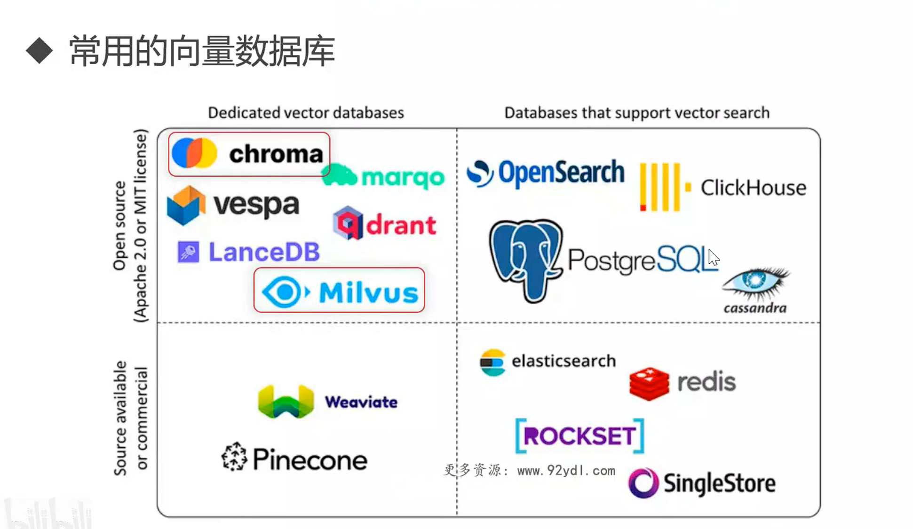
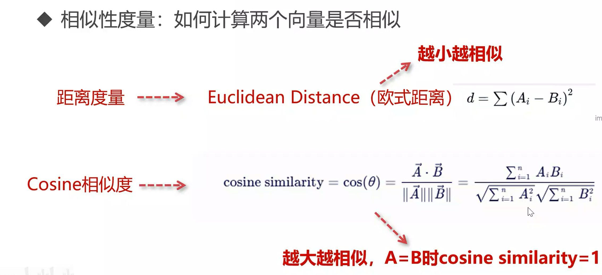

# RAG（检索增强生成）

## RAG是什么

**RAG是企业在解决冲突（大模型生成的随机性`VS`公司要求输出的精准性）的中实际工程化落地的产物**

将企业知识库通过RAG技术来提高大模型回答精准度，缓解大模型幻觉

## RAG三大核心

* 知识库
* 检索
* 大语言模型

## 大模型的long context VS RAG

**不现实**

问题

> 1. token成本
> 2. 知识库中内容安全
> 3. 对模型的超长上下文处理能力要求高

## RAG技术栈： 60分到90分的跨越

### 面临问题

1. 数据复杂多样
2. 如何构建知识库
3. 用户问题多样
4. 如何高效检索
5. 如何处理多个上下文信息，如何编写合适的prompt
6. 如何评估RAG系统

### 面对这些挑战所出现的RAG技术

....

## 课程案例说明

## 什么是大语言模型

文字接龙，概率模型

### 分词

* BPE Tokenizer分词法（从小到大合并）

### Transformer

* self-Attention(multi-head-attention)

  > 目的 --> 理解词语的语义，生成好的语义特征

  **在transformer中使用`self-attention自注意力机制`来建立每个token和其他token之间的相关性**

### 发展史

OpenAI：

## 国内外大模型产品

### 大模型生态

## 没有GPU如何调用大模型

ollama

## 分辨模型好坏

* 模型大小对模型能力的影响：涌现能力
* 评测指标

## RAG应用：挑选大模型的四大步骤

* 模型大小选择
* 模型能力测试
* 成本和设备
* 企业数据安全

## RAG核心二：挑选合适的RAG的向量Embedding模型

* embedding模型的重要性
* embedding是如何练成的
* 了解主流中文embedding模型
* 如何挑选embedding模型
* 实战

### 主流embedding模型

* BERT --> Transformer中的encoder部分
* BERT架构--阿里的GTE系列
* BERT架构--BAAI的BGE系列

### 挑选embedding模型

**关注维度**

* 任务
* 语言支持
* 评测分数
* 模型大小和内存使用
* embedding维度
* 最大token数

## RAG核心三：企业级的向量数据库选型和高效使用

### 主流向量数据库

**什么是向量数据库:**提供特定的存储结构和索引算法，能够高效地存储，查询和处理向量数据

* chroma
* Milvus

### 企业级向量数据库的要求

* 可扩展性
* 吞吐量，测QPS
* 稳定性

### 向量数据库相似性度量

1. 距离度量 --> 欧式距离
2. Cosin相似度 --> 余弦值

### 向量数据库中的索引技术

**索引**：快速检索和定位数据

ANN：近似最近邻搜索

* Inverted file index (IVF)：基于划分的方法
* HNSW：基于分层的图索引

**乘积量化（Product Quantization，PQ）**：量化压缩

高维向量 --> 内存占用大（数据和索引）

PQ-乘积量化 --> 用整型int8代替float来构建索引，显著压缩高维向量，实现高达97%的内存节省，最近邻搜索的速度提高5.5倍
