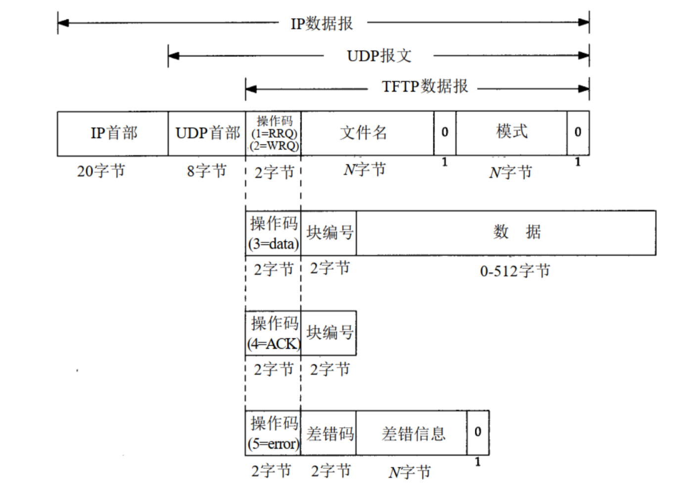
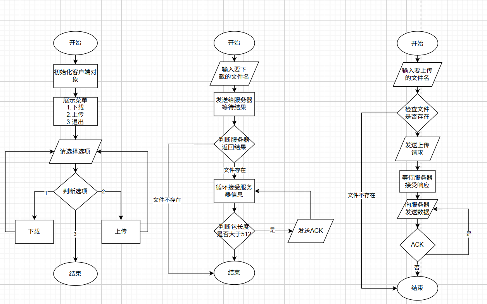
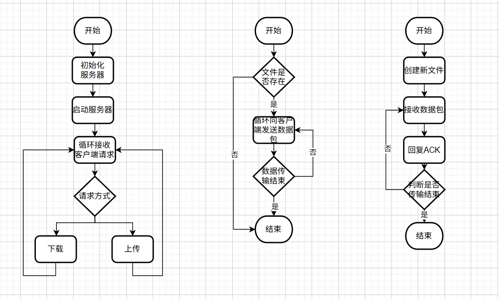

# 简单文件传送协议（TFTP，Trivial File Transfer Protocol）

* Tftp是Tcp/Ip协议族中的轻量级文件传输协议(RFC 1350)，采用UDP协议（端口号为69）实现基础文件传输功能

## TFTP核心特点

```textile
其设计哲学可概括为"精简高效"，核心特点包括：
极简命令集：仅支持读（RRQ）和写（WRQ）两种操作，无目录浏览或用户认证功能
固定数据块：每次传输512字节数据块，末块可不足额（类似快递分箱运输）
差错重传机制：采用停止等待协议，每发送一个数据块需等待确认（ACK）
轻量级实现：代码量不足FTP的1/10，适合嵌入式设备
```

## TFTP核心工作机制

```textile
TFTP通过停止等待协议（Stop-and-Wait）实现可靠传输，具体流程如下（以华为网络设备
为例）：
（1）初始化请求
客户端向服务器的熟知端口69发送RRQ（读请求）或WRQ（写请求）。比如某工厂的自动化控制
系统需从阿里云服务器下载最新程序包，客户端发送 RRQ 请求。

（2）数据分块传输
服务器响应后，双方通过动态端口通信，每个数据块固定为512字节。比如传输1024字节文件时，
分为两个数据块（512+512），最后发送一个空块（仅含首部）作为结束标志。

3）确认与重传机制
确认（ACK）：接收方收到数据块后立即发送确认报文（需标注块号）。
超时重传：若发送方未在规定时间内收到ACK，则重传该数据块。在局域网中，若某数据包因网络
波动丢失，发送方会在超时后自动重传，确保完整性。
```

## 简而言之，TFTP的优劣

> 核心优势：代码体积小（约几千字节），适合嵌入式设备（如小米智能音箱）。且无需TCP连接，适合广播或多播场景（如腾讯云边缘计算节点批量部署）。比如某数据中心的服务器在开机时通过TFTP从华为云存储获取操作系统镜像，无需本地硬盘。

> 局限性：明文传输用户名/密码，安全性低。无法浏览目录、搜索文件（需依赖其他工具），功能单一。

## TFTP报文格式



> 通信模式`netascii`或`octet`

```textile
操作码补充说明：

读文件请求包：Read request，简写为RRQ，对应Opcode字段值为1

写文件请求包：Write requst，简写为WRQ，对应Opcode字段值为2

文件数据包：Data，简写为DATA，对应Opcode字段值为3

回应包：Acknowledgement，简写为ACK，对应Opcode字段值为4

错误信息包：Error，简写为ERROR，对应Opcode字段值为5
```

## 以下为基于C++代码实现的TFTP服务器及TFTP客户端的实现

### Client

流程图（客户端流程图，下载流程图，上传流程图）：



### Server

流程图：（服务器流程图，处理下载流程图，处理上传流程图）



源码请跳转至[dline的github项目](https://github.com/Dline666/TFTP-c-)中参考
