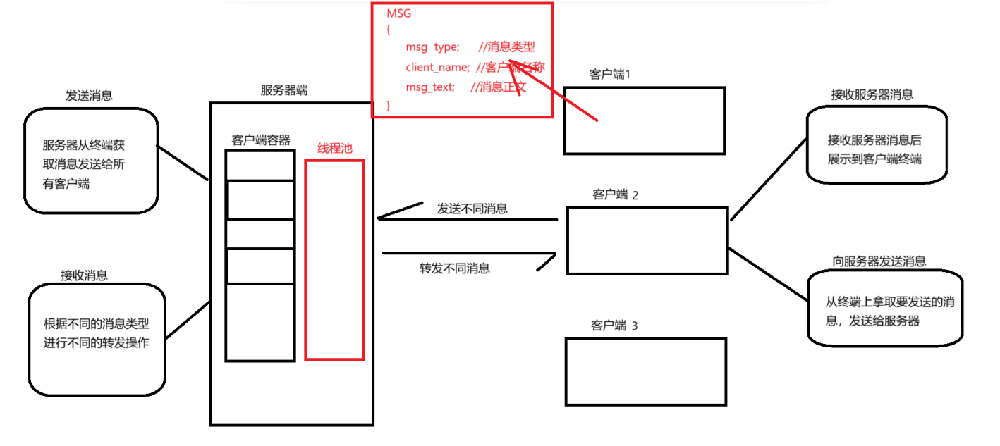
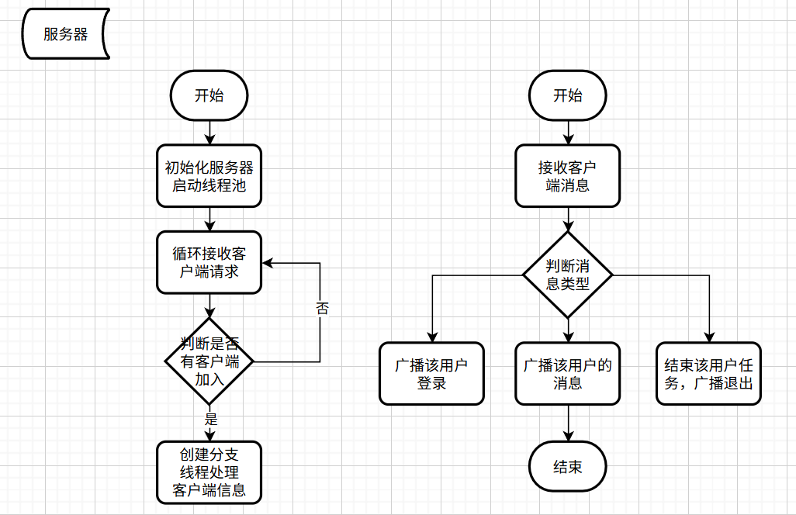

## 基于c++实现网络聊天室

#### 聊天室原理图

#### 服务器端流程图

#### 客户端流程图

#### 技术栈

* socket套接字网络通信

* 线程池

* 序列化与反序列化

#### 基础

> socket套接字通信

#### 核心技术

> 通过线程池实现聊天室任务高并发执行

> 序列化与反序列化解决内存对齐导致网络传输数据格式问题

参考源码：[网络聊天室](https://github.com/Dline666/chatRoom)
