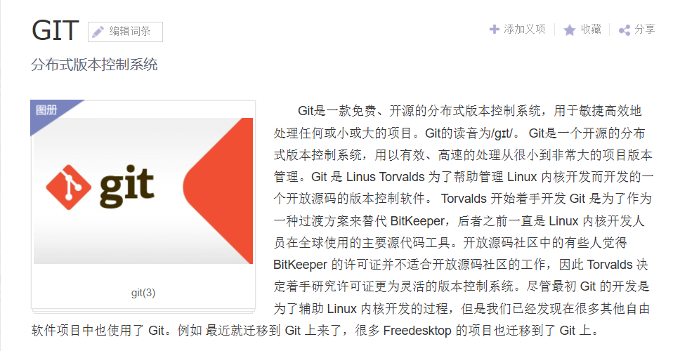
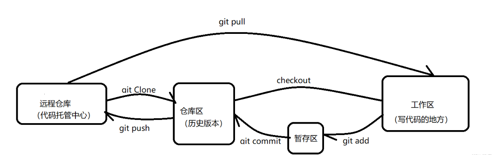

# 地表最强分布式代码管理仓库git

## git简介

* 搜狗百科的介绍
  
  * 

* 简单来说
  
  * **git是用来控制项目版本的工具**
  
  * 另外，大名鼎鼎的github用的就是git系统来管理它们的网站，这里需要区分一下，github和git是两个东西，github是一个社区，git是一个服务系统，github只支持git分布式系统，所以故名成为github。

## 安装git

进入官网下载：--->  [Git](https://git-scm.com/)  <---

* 使用git config --global配置环境

> 参数：
> 
> config：配置设置
> 
> --global：长命令全局配置

* 首次使用git可以配置邮箱和用户名，git通过这个来标识提交代码的用户（不配置的话，向要求登录权限远程仓库推送或拉取代码时需要手动输入）

```bash
#配置用户名
git config --global user.name "用户名"
#配置邮箱
git config --global user.email "邮箱"
```

## git使用的前置知识

> 四个区域：
> 
> 1.工作区：写代码的区域
> 
> 2.暂存区：暂时存放代码的区域
> 
> 3.仓库区：已经受到管理的历史版本
> 
> 4.远程仓库：相当于远程的仓库区

三个区域转换关系如下：



## git常用命令

| 命令                                | 作用           |
| --------------------------------- | ------------ |
| git config --global user.name 用户名 | 设置用户名        |
| git init                          | 初始化本地仓库      |
| git status                        | 查看本地仓库状态     |
| git add 文件名                       | 添加文件到暂存区     |
| git commit -m "日志信息" 文件名          | 提交到本地库       |
| git reflog/git log                | 查看历史记录       |
| git reset --hard 版本号              | 版本穿梭         |
| git branch 新建分支名                  | 在当前节点创建分支    |
| git merge 指定分支名                   | 将当前节点合并到指定分支 |
| git status --ignored              | 查看忽略的文件      |

* 这里附上git命令学习网站

---> [git learning](https://learngitbranching.js.org/?demo=&locale=zh_CN) <---

## 关联远端仓库


## git分支
