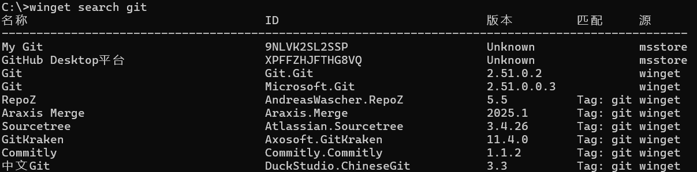

# Winget是在Windows下的一个包管理工具，基本操作如下

微软推出的Windows Package Manager（winget）作为Windows系统原生的命令行软件包管理工具，让你通过简单的命令行操作就能完成软件的安装，升级，卸载和管理，提高了开发效率和系统维护体验

以下为一般的软件安装过程：

> 搜索软件包 -> 查看软件包相关信息 -> 安装软件

分别对应以下操作（以下用git举例）

```shell
# 搜索软件包
winget search git
```



```shell
# 通过ID查看软件包信息
winget show Git.Git
```


```shell
# 安装软件
winget install Git.Git
```


# 修改winget配置

```shell
# 查看配置文件
winget settings
```
