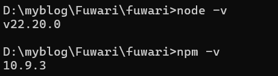
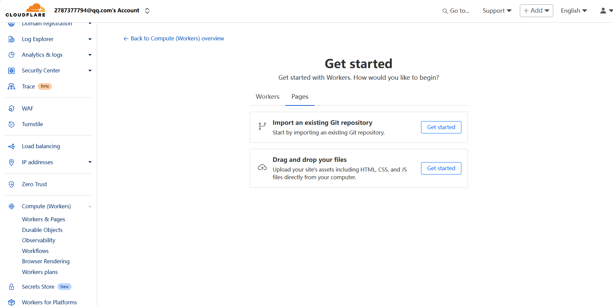

    

### 在`windows`本地部署你的个人博客，你需要在本地拥有以下环境

1. 服务端 JavaScript 环境

>  Node.js 

2. 包管理工具

> npm

3. 版本控制工具

> git

### 如何搭建环境

推荐使用`winget`包管理工具安装`node.js`，`npm`和`git`

```bash
# 用winget搜索工具找到要安装的发行版
winget search node.js
winget search npm 
# 下载需要的版本
winget install (需要的node.js版本的ID)
winget install (需要的pnpm版本的ID)
winget install (需要的git版本的ID)
```

检查本地环境是否搭建成功

在命令行中输入如下指令（如果有版本信息表示搭建成功）

```bash
# 检查node.js
node -v
# 检查pnpm
npm -v
# 检查git
git -v
```

效果图如下：



### 本地部署Fuwari

1. 进入[Fuwari](https://github.com/saicaca/fuwari),克隆项目到本地

2. 全局安装pnpm
   
   ```bash
   npm install -g pnpm
   ```

3. 现在你可以预览blog模板了
   
   ```bash
   # 在fuwari项目根目录命令行下
   pnpm -dev
   #如果想自动打开浏览器则输入
   pnpm -dev --open
   ```

4. 修改模板
   
   打开`fuwari`目录下的`src\config.ts`配置文件
   
   默认设置如下：
   
   ```ts
   import type {
       ExpressiveCodeConfig,
       LicenseConfig,
       NavBarConfig,
       ProfileConfig,
       SiteConfig,
   } from "./types/config";
   import { LinkPreset } from "./types/config";
   
   export const siteConfig: SiteConfig = {
       title: "Fuwari",
       subtitle: "Demo Site",
       lang: "en", // Language code, e.g. 'en', 'zh_CN', 'ja', etc.
       themeColor: {
           hue: 250, // Default hue for the theme color, from 0 to 360. e.g. red: 0, teal: 200, cyan: 250, pink: 345
           fixed: false, // Hide the theme color picker for visitors
       },
       banner: {
           enable: false,
           src: "assets/images/demo-banner.png", // Relative to the /src directory. Relative to the /public directory if it starts with '/'
           position: "center", // Equivalent to object-position, only supports 'top', 'center', 'bottom'. 'center' by default
           credit: {
               enable: false, // Display the credit text of the banner image
               text: "", // Credit text to be displayed
               url: "", // (Optional) URL link to the original artwork or artist's page
           },
       },
       toc: {
           enable: true, // Display the table of contents on the right side of the post
           depth: 2, // Maximum heading depth to show in the table, from 1 to 3
       },
       favicon: [
           // Leave this array empty to use the default favicon
           // {
           //   src: '/favicon/icon.png',    // Path of the favicon, relative to the /public directory
           //   theme: 'light',              // (Optional) Either 'light' or 'dark', set only if you have different favicons for light and dark mode
           //   sizes: '32x32',              // (Optional) Size of the favicon, set only if you have favicons of different sizes
           // }
       ],
   };
   
   export const navBarConfig: NavBarConfig = {
       links: [
           LinkPreset.Home,
           LinkPreset.Archive,
           LinkPreset.About,
           {
               name: "GitHub",
               url: "https://github.com/saicaca/fuwari", // Internal links should not include the base path, as it is automatically added
               external: true, // Show an external link icon and will open in a new tab
           },
       ],
   };
   
   export const profileConfig: ProfileConfig = {
       avatar: "assets/images/demo-avatar.png", // Relative to the /src directory. Relative to the /public directory if it starts with '/'
       name: "Lorem Ipsum",
       bio: "Lorem ipsum dolor sit amet, consectetur adipiscing elit.",
       links: [
           {
               name: "Twitter",
               icon: "fa6-brands:twitter", // Visit https://icones.js.org/ for icon codes
               // You will need to install the corresponding icon set if it's not already included
               // `pnpm add @iconify-json/<icon-set-name>`
               url: "https://twitter.com",
           },
           {
               name: "Steam",
               icon: "fa6-brands:steam",
               url: "https://store.steampowered.com",
           },
           {
               name: "GitHub",
               icon: "fa6-brands:github",
               url: "https://github.com/saicaca/fuwari",
           },
       ],
   };
   
   export const licenseConfig: LicenseConfig = {
       enable: true,
       name: "CC BY-NC-SA 4.0",
       url: "https://creativecommons.org/licenses/by-nc-sa/4.0/",
   };
   
   export const expressiveCodeConfig: ExpressiveCodeConfig = {
       // Note: Some styles (such as background color) are being overridden, see the astro.config.mjs file.
       // Please select a dark theme, as this blog theme currently only supports dark background color
       theme: "github-dark",
   };
   ```
   
   我们可以更改的有：
   
   title: 标题
   
   subtitle: 副标题
   
   lang: 语言（中文为zh_CN）
   
   themeColor: 主题颜色（修改hue的值）
   
   banner: 横幅（不清楚具体作用）
   
   favicon: 网站图标
   
   links: 导航链接
   
   avater: 头像
   
   name: 姓名
   
   bio: 个性签名

5. 修改结束后我们就可以开始编写个人博客了
   
   博客中的文章都会在fuwari目录下的\src\content\posts目录下存储
   
   ```bash
   # 在终端中输入如下代码可以创建一个新的md文件
   pnpm new-post [文章名称]
   ```
   
   ---
   
   默认md文件格式如下
   
   ```md
   title: test 文章标题
   published: 2025-10-08 生成日期
   description: ''
   image: ''
   tags: []
   category: ''
   draft: false
   lang: ''
   ```
   
   ---

6. 使用[cloudflare](https://dash.cloudflare.com/)上的pages服务展示个人博客网页（必须要拥有一个域名，可以选择去域名服务商购买）
   
   > notion:如果只是想在本地自己管理，不需要向外界展示，可以跳过步骤6
   
   进入[cloudflare](https://dash.cloudflare.com/)官网，注册一个账号，在左侧菜单中找到`Worker & Pages`服务
   
   
   
   找到图中页面后点击`Import an existing Git repository`选项的`Get started`,然后跟随指引与GitHub建立连接
   
   
   
   最后根据指示将你域名的DNS服务器修改为cloudflare中提供的两个DNS服务器，这样，cloudflare就可以管理你的域名了

7. 丰富你的个人博客吧！！
   
   到现在，你的个人博客已经完成了，只需要在本地编写博客后，提交到GitHub上，cloudflare就可以自动同步GitHub上的内容了

### 扩展修改

##### 将网站的`favicon`图标（即网站图标）修改

推荐使用[favicon.io](https://favicon.io/)和[在线抠图软件](https://www.remove.bg/zh)（用于制作透明贴图）进行favicon图标的制作，转换格式后，你会得到一系列尺寸的png图片，将其替换掉博客根目录中public\favicon路径下的一系列png图片，并将src\constants路径下的icon.ts文件修改，样例如下：

```ts
/***************************以下内容为个人修改***************************/

import type { Favicon } from "@/types/config.ts";

export const defaultFavicons: Favicon[] = [
    {
    src: "/favicon/favicon.ico",
        theme: "light",
        sizes: "32x32",
    },
];
```

正确修改了以上文件后，就可以看到网站的图标修改成功了
