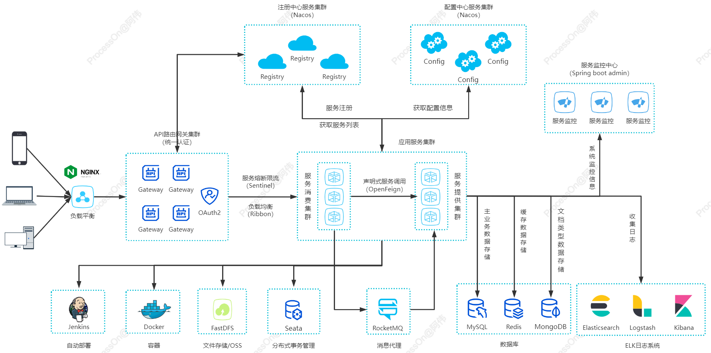

## 零壹教务系统

### **简介**

> 零壹教务管理系统是一套支持`私有化部署`的教培行业教务管理系统，专为教培行业提供`云化管理`解决方案。系统在功能上注重教务管理，具有灵活的排课、消课等核心业务功能；系统采用稳定的`微服务架构`开发，运行流程，易于部署扩展，支持私有化部署。应用端包括`PC管理端`、`老师手机端`、`家长手机端`。

### **核心功能**

- 学生管理、跟进

- 课程管理、班级、科目等教务管理

- 报名管理、预约管理、体验卡

- 排课、课表

- 家长互动：学评教、教评学、作业、成绩发布

- 消课：课堂点名、随到随学、消课次数自定义，支持二维码签到

- 在线购课

- 支持预约模式

- 物料管理

- 财务管理：报名审核，课酬统计等

- 促学模块：积分商城、老师点评送积分、积分换礼品

- 组织人员管理、职位管理、角色管理、权限管理、数据权限管理

- 系统数据统计

- `Uniapp`的家长端和老师端

  

  > ~~此次项目小组负责模块为家长移动端（登录/首页/课表等功能模块）~~

### 系统架构图

项目主体骨架基于`Spring Cloud Alibaba`生态体系，使用`MySQL`进行数据持久化管理，采用`Vue3`生态体系与`Element Puls UI`框架完成前端制作，同时项目提供`C++`微服务开发解决方案与集成、使用`Jenkins`实现`CD/CI`。

## 项目学习过程

#### 1.项目目录结构

> **zero-one-eams**
>
> > `.gitignore` -- git忽略提交配置
> >
> > `README.md` -- 项目自述文件
> >
> > `documents` -- 环境搭建、编码规范、项目需求等等文档资源
> >
> > `eams-java` -- `Java`项目主体
> >
> > `eams-cpp` -- `C++`项目主体
> >
> > `eams-frontend` -- 管理端前端项目主体
> >
> > `eams-frontstu` -- 家长端前端项目主体
> >
> > `eams-fronttea` -- 教师端前端项目主体

