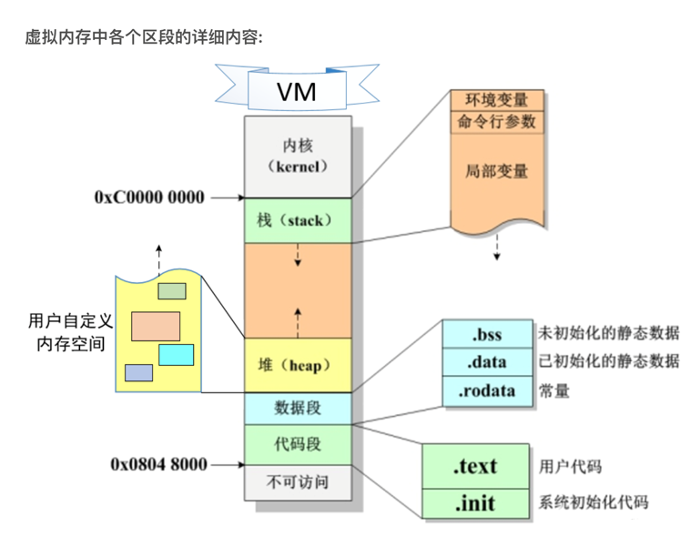

# 虚拟内存，即VM(Virtual Memory)
🤔前言：由于c/c++，python,java,go等无数语言都不是直接对硬件进行操作，而是通过操作系统来对硬件进行操作
因此，程序员无需知道内存具体如何编址，即无需关注实际的物理内存
于是，虚拟内存应运而生
## 操作系统（VM的管理者）
在操作系统层面，计算机通过MMU(Memory Management Union)内存控制单元进行物理地址向虚拟地址的映射，从而实现了对虚拟地址的掌控
> 😎tips: 虚拟地址的空间远远大于实际物理内存的空间，大小等于内存加外存的总和
## 虚拟内存分区
### 分区
这里以Linux为例
图来：

* 对于初学者来说，我们不讨论kernel和不可访问的区域（其实是我不懂🤣😂），kernel是程序需要通过操作系统来进行实际物理内存的访问所需要的程序段，不可访问是保证内存安全的（个人粗浅理解）

**接下来，让我们详细分析每个段** 
> 栈段(stack)：由程序`自动`管理的内存空间
> 堆段(heap)：由程序员`手动`管理的内存空间
> 数据段：存放程序`数据`的代码，包含（.bss），（.data）和（.rodata）三段
> 代码段：存放`程序`的代码，包含用户所写的代码(.text)和系统初始化代码(.init)
### 分区讨论
**栈段和堆段(中间一段为动态内存)**

*栈段*：
> 优点：不用程序员手动管理内存，效率更高
> 缺点：相比堆来说不够灵活

*堆段*：
> 优点：可以根据程序员的需求进行内存的管理，灵活
> 缺点：相比栈来说更加低效

**数据段**
> 存放程序中的静态数据/常量（用static关键字声明的全局/局部变量，全局变量，常量），未初始化的数据放在`.bss`段中，已经初始化的数据放在`.data`段中，常量数据放在`.rodata`段中

**代码段**
> 存放整个程序的二进制文件在`.text`中，此外还有`.init`用来系统初始化（此处顾名思义😁）

