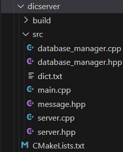

# 网络电子词典小项目

## 技术栈

* sqlite3数据库

* 套接字网络编程

* 多线程异步编程

## 项目概述

这是一个简单的网络电子词典，目的是为了学习c++开发中数据库的使用，同时熟悉网络通信，多线程的基本操作

## 项目设计

### 服务器端

> ### *数据库模块设计*
> 
> 作用：存储信息
> 
>     项目总共使用两个数据库
> 
> 1.用户数据库---------------->用于存储用户信息
> 
>     用户信息表
> 
>     用户查询历史记录表
> 
> 2.词典数据库---------------->用于存储单词信息
> 
>     词汇表

> ### *服务器模块设计*
> 
> 作用：
> 
> 1. 进行网络通信
> 
> 2. 创建服务器端套接字
> 
> 3. 初始化套接字
> 
> 4. 多线程处理客户端会话

> ### *数据模块设计*
> 
> 作用：
> 
> 1. 规定数据传输的规范
> 
> 2. 传输的数据类型
> 
>         用户注册---用户登录---用户退出---单词查询---查询历史记录
> 
> 3. 传输的数据格式
> 
>         类型+用户名+传输文本
> 
> 注意：类型是多字节整数，要进行网络字节序和主机字节序之间的转换

服务器端流程图

服务器端项目结构

### 客户端

> ### *客户端模块*
> 
> 作用：向服务器发送请求，获取消息

客户端流程图

客户端项目结构

项目源码参考：[Dline的小型网络电子词典](https://github.com/Dline666/dictionary)

### 项目注意事项（踩过的坑）

* 发送消息前记得将主机字节序转换为网络字节序

* 在客户端每次接收服务器消息前要先把套接字中的信息清空，防止干扰接收当前消息

* cmake编译出来的程序和手动编译的不一定一样（具体原理暂时不明）
